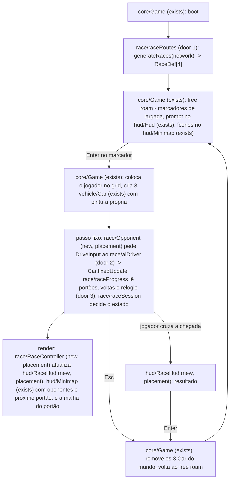

# races

## Problem

Hoje o jogo é só free roam. Não existe nada para ganhar ou perder, nenhum objetivo, nenhum tempo e nenhum adversário. Quem abre o jogo dirige pela cidade e, uns minutos depois, não tem motivo para continuar. As quatro features seguintes do roadmap (garagem, tuning de performance, carreira, extras) dependem de haver corrida. Sem corrida, tuning não tem com o que ser comparado e carreira não tem o que desbloquear.

A fonte é o roadmap em `.specs/STATE.md`, item 2: "corridas - checkpoints, cronômetro, sprint/circuito, IA oponente por waypoints". Não há métrica. Decisões do usuário em 2026-09-27: a corrida começa por um marcador na cidade (como no NFSU2), e a IA não tem catch-up.

Lido no código:
- A `RoadNetwork` do seed 1337 tem 13 estradas, todas polilinhas 3D com ponto a cada 2 m (AD-010):
  - rodovia em anel fechada: id 0, 6309 m;
  - 6 avenidas de anel a anel, com 1848 a 2066 m: ids 1-3 ao longo de x em z ≈ -300, 0 e 300, e ids 4-6 ao longo de z em x ≈ -300, 0 e 300;
  - 6 estradas de morro sem saída: 996 a 3000 m, subindo até 63-89 m.
  - Não existe grafo de cruzamentos. A ponta de cada avenida fica sobre o anel (`avenueEnd`), e as avenidas se cruzam no centro.
- O `Car` recebe só `DriveInput` (`throttle`, `brake`, `steer` com sinal, `handbrake`). O volante vai para `sign(steer)`, com rampa (`src/vehicle/drivetrain.ts:127`). A cor da carroceria está fixa em `#ff4d1a` (`src/vehicle/Car.ts:474`). Não há como remover um `Car` do mundo.
- A física do mundo inteiro é criada no boot (AD-010). Então um carro longe da câmera continua batendo em prédio.
- Os testes em node já montam o mundo real do seed 1337 com `WorldPhysics` e o Rapier de verdade (`tests/physics/interiors.test.ts`).

Quando isto sair:
- A cidade tem 4 marcadores de largada, visíveis no chão e no minimapa. Parar num deles e apertar Enter começa a corrida.
- A corrida tem contagem 3-2-1, três oponentes com o mesmo carro, portões de checkpoint em ordem, cronômetro, voltas, posição ao vivo e uma tela de resultado.

## Flow

Reusa a `RoadNetwork` (pontos a cada 2 m) como traçado, o `Car` com `DriveInput` e `DEFAULT_CAR` como carro dos oponentes, o `simTime` do passo fixo como relógio (AD-006), `nearestRoadPoint`/`roadHeading` de `world/worldMath`, `InputManager.onPress` para teclas, e os padrões de DOM do `Hud` e de canvas do `Minimap`.

## Impact

| Front | What changes |
| --- | --- |
| domain | novo termo `RaceDef`: uma corrida, com id, tipo, voltas, traçado, portões, grid e marcador (door 1). Vive em `src/race/`. A carreira (sub-projeto 5) vai guardar resultado pelo `id` |
| domain | novo termo `Gate` (portão): linha que cruza a pista num ponto do traçado, com meia-largura. Só o próximo portão em ordem conta |
| domain | novo termo `Racer`: jogador ou oponente numa corrida, com próximo portão, volta, tempo e posição |
| domain | tecla `R` significava "desvira o carro onde está" (`Game.ts:268`). Durante a corrida passa a significar "volta ao último portão cruzado". No free roam não muda. Hoje só o `Game` e `tests/e2e/drive.spec.ts` (free roam) dependem disso |
| domain | reset na água (door 9 da city-terrain): durante a corrida manda o jogador para o último portão, não para a estrada mais próxima, que pode ser outra estrada e pular o traçado. No free roam não muda |
| vehicle | `Car` ganha cor de carroceria no construtor (padrão `#ff4d1a`, igual à de hoje) e um jeito de sair do mundo (`dispose`: corpo, collider, controlador e malha). O comportamento físico não muda. A malha de todo carro se chama `car`. O oponente com o modelo glb junta carroceria e aerofólio numa malha tingida e desenha as 4 rodas numa `InstancedMesh` (C34: 2 draw calls por passe em vez de 6) |
| efeitos | faíscas e tranco de câmera por batida passam a olhar só o chassi do jogador (`Game.ts`, fila de eventos de contato): os oponentes também geram eventos |
| input | Enter e Escape viram teclas de jogo. `KEYMAP` (dirigir) não muda |
| hud | `index.html` ganha prompt, contagem, painel de corrida e resultado. A linha de ajuda (`#help`) cita Enter e Esc |
| checks existentes | continuam valendo: city-terrain C38 (draw calls ≤ 220, agora medido também com a corrida rodando), dirigibilidade (car-handling, car-feel, yaw-assist, corner-assist) sem mudança, porque o jogador usa o mesmo `Car` |
| stored data | nada para migrar: nada é persistido, e as corridas saem do seed |

## Relations

None - no stored-data shape change. `RaceDef` é gerado no boot a partir da rede de estradas, nada vai para disco.

## Surface

None - nothing consumed outside. `window.__game.race` (só DEV) expõe as corridas, o estado da sessão, os racers e comandos para as provas.

## Landing

| One-way door | Literal shape | Alternative rejected |
| --- | --- | --- |
| 1. definição de corrida | `src/race/raceRoutes.ts` puro exporta `type RaceKind = 'sprint' \| 'circuit'`, `interface RaceGate { x: number; y: number; z: number; heading: number; halfWidth: number; s: number /* m ao longo do traçado */ }`, `interface GridSlot { x: number; y: number; z: number; heading: number }`, `interface RaceDef { id: string; name: string; kind: RaceKind; laps: number; route: { points: Float32Array /* x,y,z */; closed: boolean; length: number }; gates: RaceGate[] /* o último é a chegada; no circuito, a linha de largada/chegada */; grid: GridSlot[] /* 4; o jogador fica no 3 */; marker: { x: number; z: number; radius: number } }` e `generateRaces(network: RoadNetwork): RaceDef[]`. Cada corrida sai de uma regra sobre a geometria (ex. "a avenida ao longo de x com z médio mais perto de 0"), nunca de id de estrada nem de coordenada escrita à mão. Ids: `circuito-centro`, `circuito-anel`, `sprint-cruzada`, `sprint-morro` | corridas escritas à mão com `roadId` e índices: quebram em silêncio quando o gerador de estradas mudar a ordem ou o traçado. Os ids em texto ficam, porque a carreira vai guardar resultado por eles |
| 2. como a IA dirige | cada oponente é um `Car` com `DEFAULT_CAR`, controlado só pelo `DriveInput` que `src/race/aiDriver.ts` (puro) devolve a cada passo: `aiDrive(car: AiView, route, ai: AiState, skill: number, dt: number): DriveInput`. Nenhuma força, torque ou teleporte na IA fora do `Car`, com uma exceção: o reset de travado para o último portão. Registrar como AD-015, que estende a AD-014 | carro cinemático seguindo o traçado: atravessa o jogador e não bate em nada. Escala de torque para catch-up: o usuário escolheu sem catch-up (2026-09-27) |
| 3. relógio da corrida | tempo = soma dos passos fixos de 1/60 s desde o GO (o mesmo `simTime` da AD-006), guardado em segundos e mostrado como `m:ss.cc` | `performance.now()`: depende do FPS e da aba em segundo plano, e a carreira vai guardar esses tempos. Assim, dois tempos iguais em física são iguais no relógio |

- Nothing else in this change is hard to reverse. A forma do portão, as cores, o raio do marcador, a velocidade de curva da IA e o layout do HUD são ajuste.

## Criteria

### S1: corridas na cidade e largada (P1)

Os 4 marcadores aparecem, e o jogador começa uma corrida por um deles.

**Acceptance Criteria**

1. The system SHALL gerar da `RoadNetwork` do seed 1337 exatamente 4 corridas, nesta ordem:
   - `circuito-centro`: circuito, 2 voltas, o quadrado das avenidas em x ≈ ±300 e z ≈ ±300;
   - `circuito-anel`: circuito, 1 volta na rodovia em anel;
   - `sprint-cruzada`: sprint, da ponta oeste da avenida em z ≈ 0 até o cruzamento do centro, e dali pela avenida em x ≈ 0 até a ponta em z > 0;
   - `sprint-morro`: sprint, a estrada de morro mais longa, do começo ao fim.

   Gerar duas vezes com o mesmo seed SHALL dar corridas idênticas.
2. The system SHALL montar o traçado de cada corrida com pontos consecutivos a no máximo 4 m um do outro na horizontal e cada ponto a no máximo meia largura da estrada de algum ponto de estrada. No circuito, o último ponto SHALL ficar a no máximo 4 m do primeiro.
3. The system SHALL dar a cada traçado um comprimento (uma volta, no circuito) dentro destas faixas: `circuito-centro` 2200-2700 m, `circuito-anel` 6200-6400 m, `sprint-cruzada` 1800-2300 m, `sprint-morro` 2800-3000 m, com ±0.01 m de tolerância em cada limite (renegociado em 2026-09-27: erro de float32 dos pontos).
4. The system SHALL pôr portões a no máximo 250 m um do outro ao longo do traçado, cada um com meia largura = meia largura da estrada + 4 m. O último portão do sprint SHALL ficar a no máximo 4 m do fim do traçado. O último portão do circuito SHALL ser a linha de largada/chegada.
5. The system SHALL pôr os 4 lugares do grid sobre o asfalto (a no máximo meia largura da estrada - 1 m do centro), atrás da linha de largada (entre 6 e 24 m antes dela), a pelo menos 5 m um do outro, virados para o traçado (diferença de heading ≤ 5°).
6. IF a regra de uma corrida não encontra a estrada dela THEN the system SHALL deixar essa corrida de fora, manter as outras e escrever `race <id> skipped: <motivo>` no console.
7. WHILE free roam the system SHALL mostrar no chão um anel de luz de raio 10 m no marcador de cada corrida, e no minimapa um ícone para cada marcador que cai dentro da janela do minimapa.
8. WHILE free roam, WHEN o jogador está a no máximo 10 m do centro de um marcador a menos de 30 km/h THEN the system SHALL mostrar o prompt `ENTER · <nome da corrida>`. Fora dessa condição o prompt SHALL ficar escondido.
9. WHEN o jogador aperta Enter com o prompt visível THEN the system SHALL começar a contagem:
   - põe o carro do jogador parado no lugar 3 do grid;
   - cria 3 oponentes parados nos lugares 0, 1 e 2;
   - troca o estado para `countdown`.
10. IF o jogador aperta Enter sem prompt visível THEN the system SHALL não fazer nada.
11. WHILE `countdown` the system SHALL ignorar o input de dirigir de todos os carros e manter cada um a menos de 1 km/h. O HUD SHALL mostrar `3`, `2` e `1` a cada 1.0 s de simulação e `GO` aos 3.0 s. Nesse instante o estado vira `racing` e o relógio parte de 0.

**Independent test:** no browser, teleportar para um marcador, apertar Enter, ver os 4 carros no grid e a contagem até GO.

### S2: portões, relógio, voltas e chegada do jogador (P1)

Uma corrida inteira, do GO até o resultado, olhando só o jogador.

**Acceptance Criteria**

12. WHILE `racing` the system SHALL mostrar só o próximo portão do jogador como malha visível (uma faixa luminosa de 4 m de altura cruzando a pista), e o mesmo portão no minimapa.
13. WHEN o centro do chassi de um racer cruza, andando para a frente no traçado, o segmento do seu próximo portão (dentro de `halfWidth`) THEN the system SHALL avançar o próximo portão dele em 1. Cruzar qualquer outro portão, ou o próximo de ré, SHALL não mudar nada.
14. WHILE `racing` the system SHALL mostrar o tempo do jogador como `m:ss.cc`, igual à soma dos passos fixos desde o GO, com erro máximo de 0.01 s.
15. WHEN um racer num circuito cruza a linha de largada/chegada depois de todos os outros portões da volta THEN the system SHALL somar 1 volta. O HUD SHALL mostrar `VOLTA v/N` do jogador, com `v` entre 1 e N.
16. WHEN o jogador cruza o último portão da última volta THEN the system SHALL congelar o tempo do jogador, trocar o estado para `finished` e mostrar o resultado.
17. WHILE `racing` the system SHALL mostrar no HUD `POS p/4`, a posição atual do jogador.

**Independent test:** no browser, começar `sprint-cruzada` e usar a sonda DEV para levar o jogador portão a portão. O tempo, a posição e o resultado aparecem.

### S3: oponentes (P1)

Três carros correm de verdade: o mesmo carro, a mesma física, sem trapaça.

**Acceptance Criteria**

18. The system SHALL dirigir cada oponente só pelo `DriveInput` que o `aiDriver` devolve ao `Car.fixedUpdate` do oponente, com `DEFAULT_CAR`. A única outra ação num oponente SHALL ser o reset de travado (AC 21).
19. The system SHALL dar habilidades 0.80, 0.88 e 0.95 aos oponentes 0, 1 e 2. A habilidade escala a velocidade-alvo de curva. Cada oponente segue o traçado deslocado de lado (-3, 0 e +3 m) e tem uma pintura própria, diferente da `#ff4d1a` do jogador e das outras duas.
20. WHEN cada oponente corre sozinho, em node, no mundo físico real do seed 1337 THEN the system SHALL fazê-lo terminar cada uma das 4 corridas antes de 420 s de simulação, com no máximo 1 reset de travado por corrida. Na mesma corrida, os tempos SHALL cair com a habilidade: 0.95 < 0.88 < 0.80.
21. IF um oponente anda menos de 5 m ao longo do traçado em 4 s de `racing`, ou o chassi dele desce abaixo de y = -1.5 m, THEN the system SHALL colocá-lo parado no último portão que ele cruzou (no lugar do grid, se não cruzou nenhum), virado para o traçado.
22. WHILE `racing` the system SHALL desenhar cada oponente no minimapa como um ponto na cor da pintura dele, quando estiver dentro da janela do minimapa.
23. WHEN a corrida termina (resultado fechado) ou é abandonada THEN the system SHALL tirar do mundo os 3 oponentes, com corpo, collider, controlador e malha. O número de corpos rígidos do mundo SHALL voltar ao valor de antes da largada.

**Independent test:** `npm test` roda os oponentes sozinhos em cada corrida no mundo real e confere chegada, tempo e resets.

### S4: posição e resultado (P2)

**Acceptance Criteria**

24. The system SHALL ordenar os racers assim:
    - primeiro quem terminou, pelo tempo de chegada;
    - depois pela volta (maior primeiro);
    - depois pelo próximo portão (maior primeiro);
    - por último pela distância horizontal até o próximo portão (menor primeiro).
25. WHEN o estado vira `finished` THEN the system SHALL mostrar o resultado com as 4 linhas na ordem da AC 24 naquele instante:
    - posição, nome (`VOCÊ` ou o nome do oponente) e tempo `m:ss.cc` de quem terminou;
    - `--:--.--` para quem não terminou.
26. WHEN o jogador aperta Enter com o resultado na tela THEN the system SHALL voltar ao free roam com o carro do jogador onde está, esconder o painel de corrida e aplicar a AC 23.

**Independent test:** terminar uma corrida pela sonda DEV com um oponente na frente e ver a ordem e os tempos no resultado.

### S5: reset, abandono e free roam intacto (P2)

**Acceptance Criteria**

27. WHILE `countdown` ou `racing`, WHEN o jogador aperta R THEN the system SHALL colocá-lo parado no último portão que ele cruzou (no lugar 3 do grid, se não cruzou nenhum), virado para o traçado. O relógio SHALL continuar correndo.
28. WHILE `racing`, IF o chassi do jogador desce abaixo de y = -1.5 m THEN the system SHALL aplicar o mesmo reset da AC 27, e não o reset para a estrada mais próxima.
29. WHILE `countdown` ou `racing`, WHEN o jogador aperta Escape THEN the system SHALL abandonar a corrida sem resultado:
    - volta ao free roam;
    - esconde o painel de corrida;
    - aplica a AC 23.
30. WHILE `countdown`, `racing` ou `finished` the system SHALL esconder os marcadores de largada e o prompt. Enter só SHALL fechar o resultado.
31. WHILE free roam the system SHALL manter R e o reset na água como são hoje: R desvira no lugar, e a água manda para a estrada mais próxima.
32. WHILE `racing` com 3 oponentes, the system SHALL manter as draw calls por frame ≤ 220 (o limite da city-terrain C38).

**Independent test:** no browser, durante a corrida, R volta ao portão, Esc volta ao free roam, e R no free roam continua desvirando no lugar.

## Out of scope

| Excluded | Why |
| --- | --- |
| guardar melhor tempo, dinheiro e desbloqueio | carreira, sub-projeto 5, com save em `localStorage` |
| catch-up (rubber band) da IA | escolha do usuário (2026-09-27) |
| tráfego, drift e drag | extras, sub-projeto 6 |
| IA que desvia e ultrapassa de propósito | V1 segue a linha com deslocamento lateral fixo e bate como carro real. Desviar é outra camada |
| aviso de contramão e seta de direção | o portão visível e o minimapa já mostram o caminho. Fica para ajuste depois de jogar |
| som de motor dos oponentes | o `AudioEngine` tem uma voz só. Mais vozes é trabalho de áudio à parte |
| reiniciar corrida por tecla | Esc e Enter no marcador já refazem a corrida em dois passos |
| pausa | não existe pausa no jogo hoje |

## Assumptions

| Assumption | Chosen default | Rationale | Confirmed? |
| --- | --- | --- | --- |
| quais corridas e quantas voltas | as 4 da AC 1 (2 voltas no centro, 1 no anel) | usa as estradas que existem: o quadrado das avenidas, o anel, uma travessia com curva no centro e o morro de 3 km. Cada corrida leva uns 2-4 min | y |
| lugar do jogador no grid | fila de trás (lugar 3) | largar atrás, como no NFSU2, dá o que ultrapassar | y |
| oponentes depois da chegada do jogador | o resultado é uma foto do instante da chegada. Quem não terminou mostra `--:--.--` | não precisa esperar a IA nem estimar tempo | y |
| nomes dos oponentes | três nomes fixos, curtos, em pt-BR, definidos no build | não é decisão de produto que mude comportamento | y |
| velocidade para o prompt aparecer | < 30 km/h dentro de 10 m | evita começar corrida passando reto pelo marcador | y |

**Open questions:** none - all resolved or logged above.

## Observable

| Surface | Decision | Landing |
| --- | --- | --- |
| tela free roam: marcador e prompt | estado vazio | AC 6 (corrida faltando some, as outras ficam) e AC 8 (sem marcador perto, sem prompt) |
| tela free roam: marcador e prompt | carregando | n/a - as corridas são geradas no boot, antes do primeiro frame, junto com a cidade |
| tela free roam: marcador e prompt | erro | AC 6 |
| tela free roam: marcador e prompt | sem autorização | n/a - jogo local, um jogador, sem conta |
| tela de contagem | densidade e ordem | AC 11 |
| painel de corrida | densidade e ordem | AC 14, AC 15, AC 17: tempo, volta e posição. O velocímetro continua |
| painel de corrida | ação destrutiva confirma antes | n/a - Esc abandona sem confirmar. Refazer custa um Enter no marcador, e confirmar no meio da corrida atrapalha mais do que protege |
| tela de resultado | densidade e ordem | AC 24, AC 25 |
| tela de resultado | estado vazio | AC 25 (`--:--.--` para quem não terminou) |
| minimapa | ordem e densidade | AC 7, AC 12, AC 22 |
| teclas novas Enter e Escape | o que imprime quando falha | AC 10, AC 30 |

## Sources

- `.specs/STATE.md` roadmap item 2 - escopo das corridas
- escolhas do usuário em 2026-09-27: entrada por marcador na cidade, IA sem catch-up
