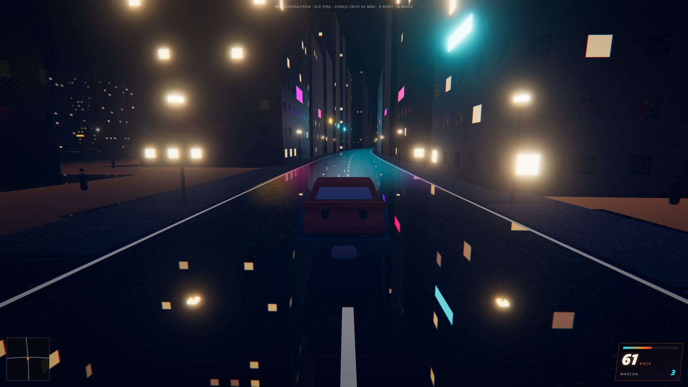
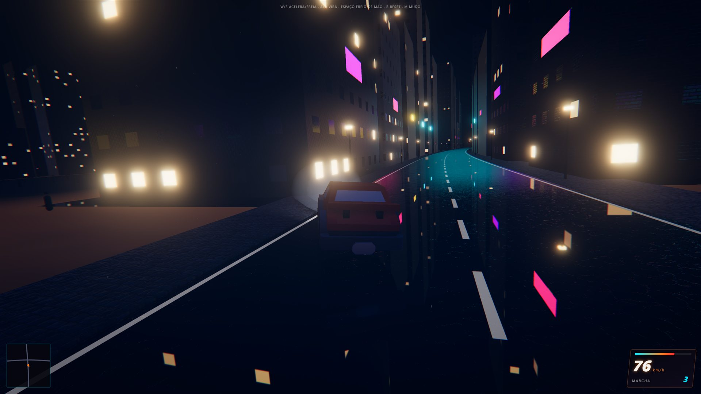
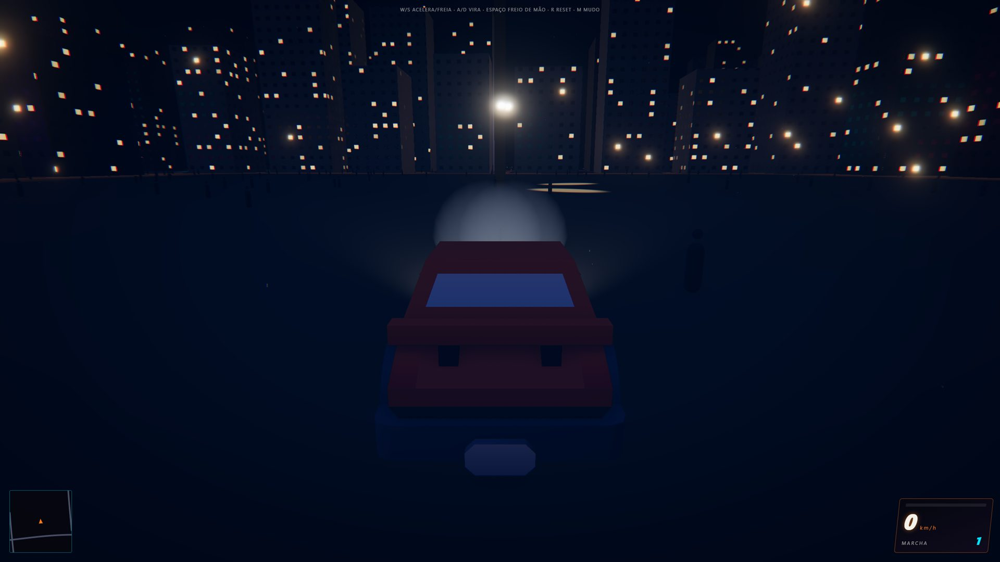
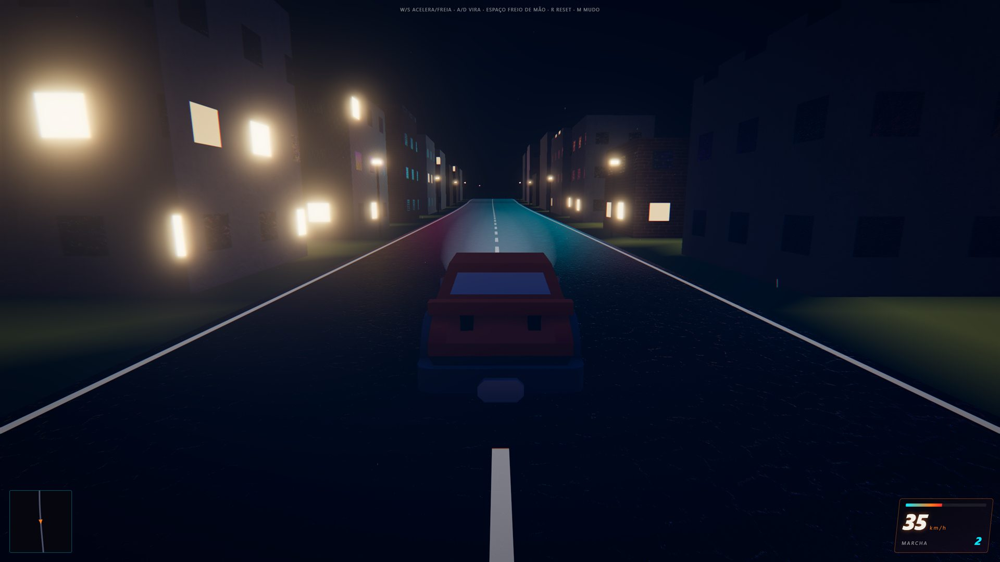
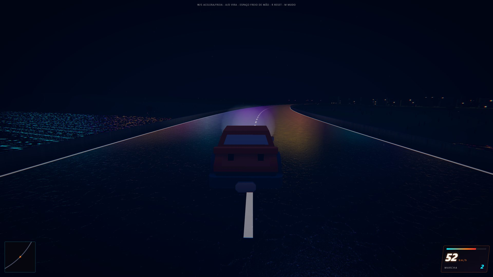

# Underground Night

Jogo de corrida de rua noturno que roda direto no navegador, inspirado em Need for Speed
Underground 2. A cidade inteira é gerada por código a partir de uma semente, e o carro tem física
de verdade: suspensão, câmbio de 6 marchas, aderência dos pneus e duas ajudas arcade para fazer
curva em alta sem capotar. É um experimento em andamento de quem está aprendendo 3D: por enquanto
dá para dirigir livre pela cidade; as corridas ainda não existem.



| | |
| --- | --- |
|  |  |
|  |  |

## Como rodar

Precisa de Node.js 22 ou mais novo.

```bash
npm install
npm run dev        # abre em http://localhost:5173
```

Na primeira tecla o som liga (o navegador só libera áudio depois de uma interação).

| Tecla | Ação |
| --- | --- |
| `W` | acelerar |
| `S` | frear; parado, dá ré |
| `A` / `D` | virar |
| `Espaço` | freio de mão |
| `R` | reposicionar o carro |
| `M` | mudo |

Em máquina mais fraca, abra com `?quality=low` (`http://localhost:5173/?quality=low`): desliga a
oclusão de ambiente (GTAO) e o reflexo da rua, e reduz a chuva e os vagalumes.

Outros comandos:

```bash
npm run build      # checa os tipos e gera o build de produção em dist/
npm run preview    # serve o build de produção
npm test           # testes unitários e de física (vitest)
npm run test:e2e   # testes no navegador (Playwright + Chromium)
```

## O que já existe

- **Cidade procedural de 3 km:** morros, rio, baía, rodovia em anel, pontes e bairros. O terreno é
  um heightfield de 769 × 769 pontos a cada 4 m; as ruas são polilinhas 3D e os prédios nascem nos
  lotes ao longo delas. A mesma semente (`1337`) gera sempre o mesmo mapa. As malhas carregam por
  chunks de 512 m conforme o carro anda.
- **Miolo das quadras:** o espaço entre os prédios tem quintais, piscinas, árvores balançando ao
  vento, vagalumes, obras com guindaste de luz piscando e pedestres andando.
- **Carro com física real:** um veículo por raycast do Rapier, com suspensão por roda, câmbio
  automático de 6 marchas, freio-motor, freio de mão com derrapagem e rolagem da carroceria nas
  curvas. Duas ajudas arcade deixam o carro ágil: um torque que faz ele apontar rápido para a curva
  e uma força no centro de massa que fecha a trajetória em alta velocidade sem gerar tombamento.
- **Visual noturno:** materiais PBR, neon, bloom, oclusão de ambiente, reflexo molhado da rua,
  chuva, fumaça, faíscas, marcas de pneu e uma câmera que inclina junto com o carro.
- **Som sintetizado:** o ronco do motor é gerado na hora com Web Audio, sem arquivos de áudio.
- **HUD:** velocímetro, marcha, conta-giros e minimapa.

## Tecnologias

| Parte | Tecnologia |
| --- | --- |
| Linguagem e build | TypeScript, Vite |
| Render | Three.js (WebGL, EffectComposer, bloom, GTAO, shaders próprios via `onBeforeCompile`) |
| Física | Rapier 3D (WebAssembly), `DynamicRayCastVehicleController` |
| Áudio | Web Audio API |
| Testes | Vitest (unitários e física real em Node), Playwright (navegador) |

Sem framework de UI: o HUD é HTML e CSS.

## Estrutura

```
src/
├── core/      loop, passo fixo de física, input, qualidade, montagem do jogo (Game.ts)
├── world/     terreno, ruas, lotes, prédios, água, chuva, streaming por chunks
│   ├── terrain/    heightfield e ruído
│   ├── roads/      rede de ruas, malhas e pontes
│   ├── lots/       lotes e prédios
│   └── interiors/  miolo das quadras: quintais, árvores, obras, pedestres
├── vehicle/   carro, ficha técnica (carSpec), câmbio e motor, ajudas arcade, efeitos
├── camera/    câmera de perseguição
├── hud/       velocímetro e minimapa
├── audio/     motor sintetizado
└── post/      pós-processamento de cor
tests/
├── unit/      lógica pura
├── physics/   dirigibilidade medida com o Rapier real, sem navegador
└── e2e/       integração no navegador
```

A lógica pura (sem importar `three` nem o Rapier) fica em arquivos separados e é testada com
Vitest. A integração é testada com Playwright lendo `window.__game`, que só existe em modo de
desenvolvimento.

Convenções: metros e segundos, Y para cima, frente do carro em `+Z`, física em passo fixo de
1/60 s, e nada de `Math.random` na geração do mundo (tudo sai do PRNG `mulberry32` com a semente).

## Como é feito

Cada funcionalidade passa por quatro etapas, registradas em [`.specs/`](.specs/):

1. **Plano** (`plan.md`): o problema, o caminho no código e os critérios de aceite, revisados antes
   de qualquer código.
2. **Checks** (`checks.md`): cada critério vira uma afirmação com um valor concreto e o teste que
   a prova.
3. **Build:** testes escritos a partir dos checks, depois a implementação.
4. **Verificação** (`verification.md`): um agente que não escreveu o código confere cada check e
   injeta defeitos de propósito para provar que os testes pegam.

O código foi escrito em parceria com IA (Claude Code). Decisões de arquitetura e o roadmap ficam em
[`.specs/STATE.md`](.specs/STATE.md).

## Roadmap

1. ~~Cidade livre~~: carro, cidade procedural, HUD, som, terreno, dirigibilidade, miolo das quadras
   (concluído). Próximo extra: vapor de dutos, holofotes, estacionamentos, gatos e trem.
2. Corridas: checkpoints, cronômetro, sprint e circuito, oponentes com IA.
3. Garagem e tuning visual: pintura, rodas, vinil, body kit, neon embaixo do carro.
4. Tuning de performance: motor, turbo e pneus mudando a física.
5. Carreira: progressão, dinheiro, desbloqueios, save local.
6. Extras: drift, arrancada, tráfego.

## Créditos

- Carro: [Kenney Car Kit](https://kenney.nl/assets/car-kit), CC0
  ([licença](public/models/LICENSE-kenney-car-kit.txt)).
- Texturas: [ambientCG](https://ambientcg.com), CC0
  ([licença](public/textures/LICENSE-ambientcg.txt)). `npm run fetch:textures` baixa de novo.

O código é licenciado sob a [licença MIT](LICENSE), © 2026 forzion.tech.
